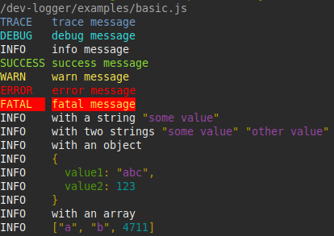

# dev-logger

[](https://badge.fury.io/js/%40inveris%2Fdev-logger)

A console logger for development purpose with human readable output and easy modifiability.



Log levels can be customized, as well as the output (via formatter methods). View [examples/](./examples/) directory.

Please do not use this logger in production mode! For production use [pino](https://github.com/pinojs/pino), [winston](https://github.com/winstonjs/winston), [bunyan](https://github.com/trentm/node-bunyan), ...


## Install

`npm install --save-dev @inveris/dev-logger`


## Usage

```js
const DevLogger = require('dev-logger')

const log = new DevLogger(__filename)

log.trace('trace message')
log.debug('debug message')
log.info('info message')
log.success('success message')
log.warn('warn message')
log.error('error message')
log.fatal('fatal message')

const str = 'some value'
log.info('with a string', str)

const obj = {
  value1: 'abc',
  value2: 123
}
log.info('with an object', obj)

const arr = [ 'a', 'b', 4711 ]
log.info('with an array', arr)
```


## Default Log-Levels

* `trace`
* `debug`
* `info`
* `success`
* `warn` / `warning`
* `error`
* `fatal`


## Options

`const log = new DevLogger(options)`

Options could be a string (group) or an object with the following settings:


* <a name="group"></a>`group` {string} Name of the group.\
  A group is a coherent block of messages that belong together.\
  Simpelst usage is setting the current filename.

  ```js
  group: __filename
  ```

* <a name="name"></a>`name` {string} An identifier at each line.\
  E.g. the application name from `package.json` could be used.

* `logLevel` {number|string} The level from where the output is visible.

* `upperCaseLevelName` {boolean} Should the level name displayd in upper case. Default `true`.

* `padStartLevelName` {boolean} Should the level name padded before. Default `false`.

* `padEndLevelName` {boolean} Should the level name padded after. Default `false`.

* `withDate` {boolean} Should the date be visible. Default `false`.

* `withGroup` {boolean} Should the group be visible. Default `true`.

* `withName` {boolean} Should the name be visible. Default `true`.

* <a name="colors"></a>`colors` {object} Colors of the output.\
  View [index.js](./lib/index.js) `defaultColors`

  ```js
  colors: {
    trace: 'green',
    info: 'blue'
  }
  ```

* <a name="levels"></a>`levels` {object} List of log methods.\
  View [index.js](./lib/index.js) `defaultLevels`

  ```js
  levels: {
    10: 'debug',
    20: 'info',
    30: 'warn warning',
    40: 'error'
  }
  ```

  In this example, we had only debug, info, warn, warning and error methods.\
  The first string is the prefix, that is visible on output, e. g. `WARN message` will be displayed with `log.warn('message'`) or `log.warning('message'`)


## Methods

* `setColors(colors)`
  * `colors` {object} Colors of the output.\
    View [Options - colors](#colors)

* `setGroup(group)`
  * `colors` {object} Name of the group.\
    View [Options - group](#group)

* `setName(name)`
  * `name` {object} An identifier at each line.\
    View [Options - name](#name)

* `setLevels(levels)`
  * `levels` {object} Name of the group\
    View [Options - levels](#levels)

* `setLogLevel(level)`
  * `level` {number|string} The level from where the output is visible.


## Custom formatter

View [examples/custom-formatter.js](./examples/custom-formatter.js).


## Examples

More examples in [examples/](./examples/) directory.

Example:

```js
const pkg = require('./package.json')

const options = {
  group: __filename,
  logLevel: 'trace',
  name: pkg.name,

  upperCaseLevelName: true,
  padStartLevelName: false,
  padEndLevelName: true,
  withDate: true,
  withGroup: true,
  withName: true
}

const log = new DevLogger(options)
log.info('Hello world!')
```
